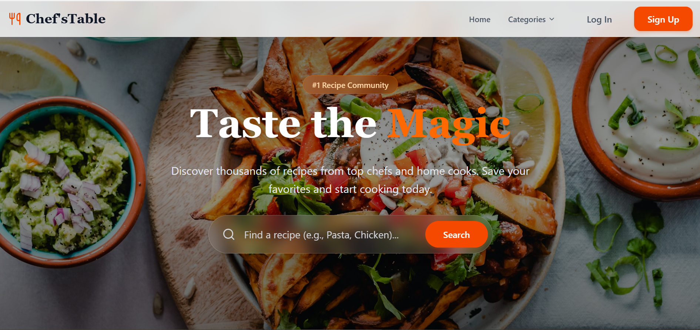
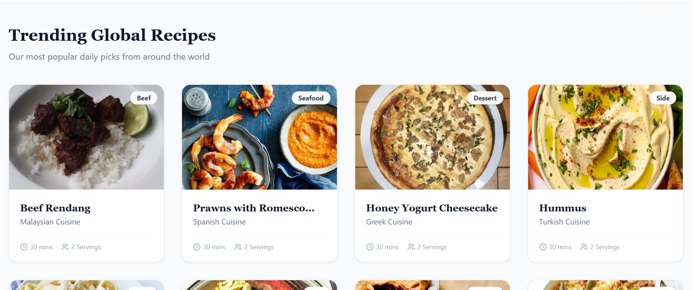
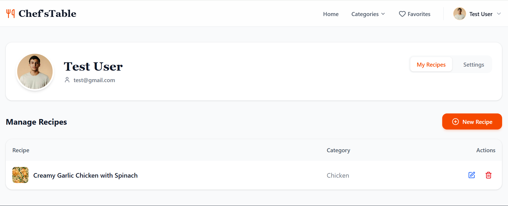
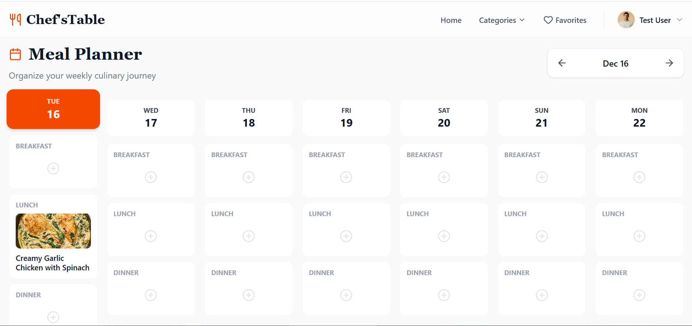
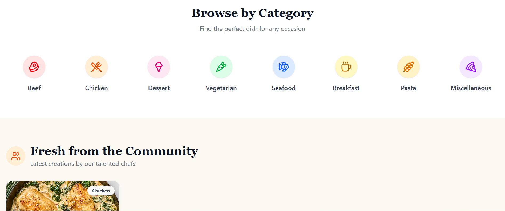
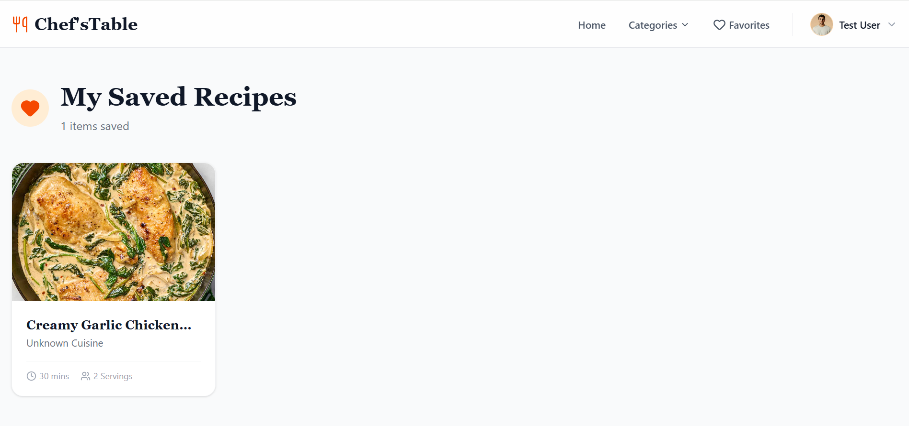

# 🍽️ Chef'sTable

**Chef'sTable** is a modern culinary platform that bridges the gap between discovering global cuisines and managing personal recipes. It features a hybrid search engine combining public data with a community-driven backend, an interactive meal planner, and social features like reviews and favorites.

---

## 📸 Project Overview

| **Landing Page** | **Trending Recipes** |
|:---:|:---:|
|  |  |

| **Dashboard & Management** | **Meal Planner** |
|:---:|:---:|
|  |  |

| **Category Browsing** | **Favorites Collection** |
|:---:|:---:|
|  |  |

---

## ✨ Key Features

### 🔐 **Authentication & User Profiles**
* **Secure Auth:** Full sign-up and login functionality powered by Firebase Authentication.
* **Profile Management:** Users can update their display name, profile picture, and manage account settings.
* **Route Protection:** Global route guards (`RouteGuard.jsx`) ensure secure access to private pages.
* **Danger Zone:** Options to permanently delete user accounts and all associated data.

### 🍲 **Recipe Ecosystem**
* **Hybrid Search:** Unified search bar querying both **TheMealDB API** (public data) and **Firestore** (community recipes) simultaneously.
* **Create & Edit:** Full CRUD capabilities allowing users to publish their own recipes with dynamic ingredient lists and instructions.
* **Community Feed:** Browse recipes created by other users in the "Fresh from the Community" section.
* **Trending:** Automatically fetches random global dishes to inspire your next meal.

### 📅 **Planning & Organization**
* **Interactive Meal Planner:** A weekly calendar view to schedule Breakfast, Lunch, and Dinner.
* **Favorites System:** One-click functionality to save and retrieve favorite recipes.
* **Smart Filtering:** Visual category filters (Beef, Vegan, Dessert, etc.) for easy browsing.

### 💬 **Social & Interaction**
* **Review System:** Users can leave comments and 5-star ratings on any recipe.
* **Dynamic UI:** Features polished toast notifications (`react-hot-toast`), skeleton loading states, and responsive mobile menus.

---

## 🛠️ Tech Stack

**Frontend Core**
* [React 18](https://reactjs.org/)
* [Vite](https://vitejs.dev/) (Build Tool)
* [Tailwind CSS](https://tailwindcss.com/) (Styling)
* [React Router DOM](https://reactrouter.com/) (Routing)

**Backend & Services**
* **Firebase Authentication**: Email/Password login handling.
* **Firebase Firestore**: NoSQL database for storing custom recipes, comments, and meal plans.
* **TheMealDB API**: External source for global public recipe data.

**Utilities & Libraries**
* `lucide-react`: Modern icon set.
* `react-hot-toast`: Beautiful, animated notifications.
* `clsx` & `tailwind-merge`: Conditional class merging for clean UI components.

---

## 🚀 Installation & Setup

Follow these steps to run the project locally.

### 1. Clone the repository
```bash
git clone [https://github.com/your-username/chefs-table.git](https://github.com/your-username/chefs-table.git)
cd chefs-table


### 2. Install dependencies
```bash
npm install

### 3. Configure Environment Variables
### Create a .env file in the root directory. You will need a Firebase project to get these credentials.
VITE_API_KEY=your_firebase_api_key
VITE_AUTH_DOMAIN=your_project.firebaseapp.com
VITE_PROJECT_ID=your_project_id
VITE_STORAGE_BUCKET=your_project.appspot.com
VITE_MESSAGING_SENDER_ID=your_sender_id
VITE_APP_ID=your_app_id

### 4. Run the development server
### Open http://localhost:5173 in your browser to verify.
```bash
npm run dev

# 📂 Code Structure
src/
├── components/
│   ├── layout/          # Navbar, Footer, Layout wrapper
│   ├── ui/              # Reusable UI (Buttons, Cards, Modals, Loaders)
│   └── RouteGuard.jsx   # Protected route logic
├── context/
│   └── AuthContext.jsx  # Global Authentication State
├── hooks/
│   └── useRecipes.js    # Logic for fetching external API data
├── libs/
│   ├── db.js            # Firestore CRUD functions (Recipes, Comments, Planner)
│   ├── firebase.js      # Firebase App Initialization
│   └── utils.js         # CSS utilities
├── pages/
│   ├── Home.jsx         # Landing page with trending & community feeds
│   ├── Dashboard.jsx    # User settings and recipe management
│   ├── MealPlanner.jsx  # Weekly calendar logic
│   ├── RecipeDetails.jsx# Dynamic single recipe view
│   ├── CreateRecipe.jsx # Form for adding new recipes
│   └── Search.jsx       # Hybrid search logic
├── screenshots/         # Project images for README
└── App.jsx              # Main routing configuration

 📄 License
 This project is open source and available under the MIT License.
